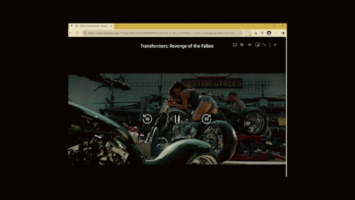
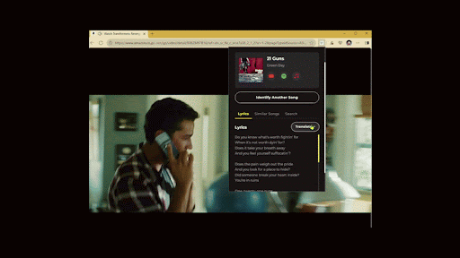
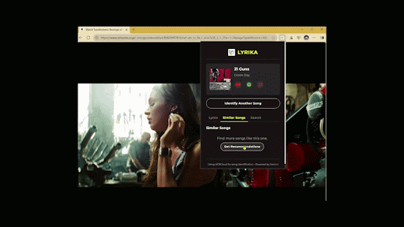

# 🎵 Lyrika

<p align="center">
  
</p>

<p align="center">
  
  
  
  
</p>

Lyrika is a browser extension that listens to audio playing in any browser tab, identifies the song, and displays its lyrics, turning your browser into a smart, lyrics-aware music player. 

(サポーターズの努力賞チーム Hackathon 7/2025)

## ✨ Features

### 🎧 One-Click Song Identification

<p align="center">
  
</p>

- Click the extension icon to start listening to the active tab's audio
- Real-time identification with "Listening..." status
- View Song Title and Artist upon successful match
- Full lyrics for the identified song appear in the popup

### 🌐 Lyrics Translation

<p align="center">
  
</p>

- Translate lyrics to various languages using Gemini AI
- Switch between languages with a simple dropdown
- Perfect for language learners and international music fans

### 🎵 Similar Songs Recommendations

<p align="center">
  
</p>

- Get recommendations for similar songs based on the current track
- Discover new music related to what you're currently enjoying
- Click to search for lyrics of recommended songs

### 🧩 Additional Features
- **Copy to Clipboard**: Click the song title to copy "Song Title by Artist"
- **Platform Links**: Open the song in YouTube, Spotify, and other music services
- **Manual Search**: Option to search for lyrics if automatic identification fails
- **Graceful Error Handling**: Clear feedback for common edge-case scenarios

## 🖥️ System Architecture

Lyrika uses a client-server architecture:

- **Browser Extension (Client)**: JavaScript-based frontend that captures audio and presents results
- **Python Flask Server (Backend)**: Processes audio and communicates with external APIs
- **External APIs**: ACRCloud for song identification, Genius for lyrics, and Google Gemini for AI enhancements

## 🚀 Quick Setup

### 1. Server Setup

```bash
# Navigate to the server directory
cd server

# Create and activate a virtual environment
python3 -m venv venv
source venv/bin/activate  # On Windows, use: venv\Scripts\activate

# Install dependencies
pip3 install -r requirements.txt
```

**Set up your API Keys:**

Create a file named `.env` in the server directory and add your API keys:
```
ACRCLOUD_HOST="YOUR_ACRCLOUD_HOST"
ACRCLOUD_ACCESS_KEY="YOUR_ACRCLOUD_ACCESS_KEY"
ACRCLOUD_ACCESS_SECRET="YOUR_ACRCLOUD_ACCESS_SECRET"
GENIUS_ACCESS_TOKEN="YOUR_GENIUS_ACCESS_TOKEN"
GEMINI_API_KEY="YOUR_GEMINI_API_KEY"
```

Run the server:
```bash
python3 app.py # PORT=5001 python3 app.py
```

The server will start on http://localhost:5001.

### 2. Browser Extension Installation

1. In Chrome, go to `chrome://extensions/`
2. Enable "Developer mode"
3. Click "Load unpacked" and select the `extension` directory
4. Update the API_BASE_URL in `extension/js/background.js` if your server is not running on localhost:5001

## ✅ Usage

Once the extension is installed and the server is running:

1. **Identify a Song**: Navigate to a tab playing music, click the Lyrika icon, then click "Identify Song"
2. **View Lyrics**: Once identified, lyrics will be displayed automatically
3. **Translate Lyrics**: Use the language dropdown to translate lyrics
4. **Find Similar Songs**: Click the "Similar Songs" button to discover related music
5. **Manual Search**: If automatic identification fails, use the search form to find lyrics manually

## 🧪 Technical Details

### Extension Flow
- User clicks the extension icon to identify a song playing in the browser
- Extension captures audio and sends it to the server
- Server processes the audio using ACRCloud and retrieves lyrics via Genius
- Results are displayed in the extension popup

### API Endpoints
- **GET /api/health**: Health check endpoint
- **POST /api/identify**: Identifies a song from audio data
- **GET /api/lyrics**: Gets lyrics for a song by title and artist
- **GET /api/translate**: Translates lyrics to a different language
- **GET /api/similar**: Gets similar song recommendations

## 💡 Contributing

Contributions are welcome! Please feel free to submit a Pull Request.

1. Fork the repository
2. Create your feature branch (`git checkout -b feature/amazing-feature`)
3. Commit your changes (`git commit -m 'Add some amazing feature'`)
4. Push to the branch (`git push origin feature/amazing-feature`)
5. Open a Pull Request

## 📄 License

This project is licensed under the MIT License - see the [LICENSE](LICENSE) file for details. 

## 📩 Contact

Naimi Nafis: [Github](https://github.com/NaimiNafis) | [Portfolio](https://naiminafis.github.io/portfolio/)

Alvin Sebastian Lienardi: [Github](https://github.com/alvinlienardi) | [Portfolio](https://alvinlienardi.github.io/portfolio/)

Duong Nam Phong: [Github](https://github.com/duongnphong) | [Portfolio](https://duongnphong.github.io/)